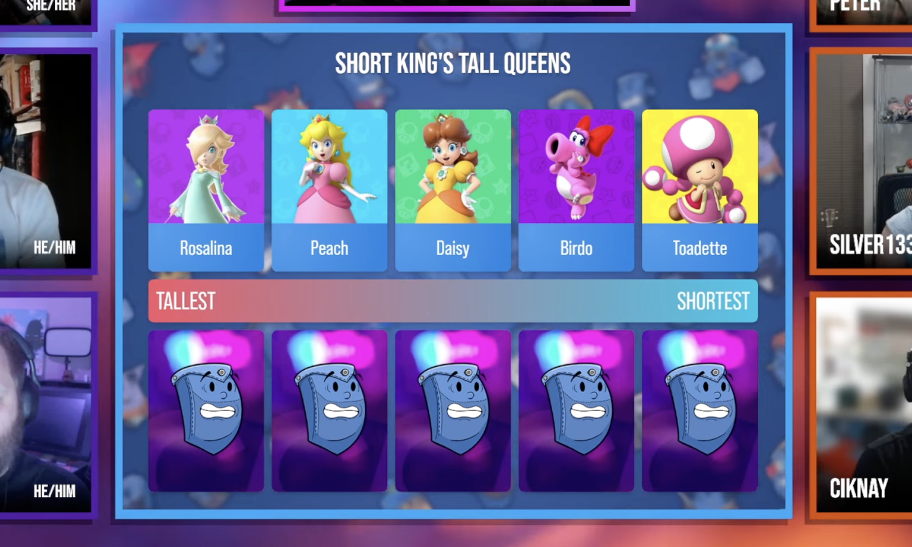
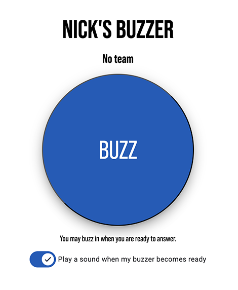

# Pocket Pals Director


## Overview

This repository contains the source code for the **Pocket Pals Director**, a web
application used to manage the games played in
[Back Pocket](https://backpocket.gg)'s Pocket Pals trivia show.

The Director has three main features:

- Game Management
- Buzzer Management
- The Video Game Database (VGDB)

Pocket Pals Director is written primarily in TypeScript using the
[Angular v19 framework](https://angular.dev), with
[Firebase](https://firebase.google.com) as the cloud backend.

### Game Management

At the time of writing, the Pocket Pals Director contains ten games, all of
which were played on Pocket Pals' 2025 season.

[](https://youtu.be/i2mu5cIeMLw)

The Director provides each game as a URL which can be displayed in a Browser
Source in any broadcast software package (such as [OBS](https://obsproject.com)
or [vMix](https://vmix.com), both of which are used by Back Pocket).



The games themselves are controlled by the Director inside of the application
itself - the game browser sources do nothing but display the game's current
state, and take care of animating that state when it changes.


While the game browser URLs are publicly accessible (so they can be added to
OBS/vMix as-is), the controller interface requires login.

### Buzzers

The Director also provides Buzzer functionality. Players can be added to the
system with a unique image and sound effect. The current state of the buzzers
are displayed in a separate browser source which can be loaded into OBS/vMix.


Each player is given a unique URL they can use to access their buzzer button,
which they can access via their PC or phone.



Clicking the button causes that player's avatar to pop up in the main browser
source, as well as also playing their sound effect.


The Director can enable or disable buzzers globally, as well as being able to
lock or unlock specific player buzzers.

### The Video Game Database

Many games in Pocket Pals require displaying some representation of a video game
on screen. To make this more visually interesting than just showing its name,
the Pocket Pals Director includes something called the Video Game Database
(VGDB):


Adding a game to the VGDB automatically fetches its main logo and hero image
from [SteamGridDB](https://steamgriddb.com). This can then be used in any game
where a question requires a video game to be provided as the answer. Typically,
when displaying a game from the VGDB, the "hero" image will be used as a blurred
background with the game's logo overlaid on-top.

For any game, it's possible to manually swap the logo or hero to any other one
available in SteamGridDB, as well as uploading a custom one.


You can also export an image of the game (e.g. its logo over the hero
background) to a variety of aspect ratios using the "Make image" option shown
above.

## Routes

When visiting the web application after it has been deployed, the following
routes become enabled:

- `/`: redirects to `/dashboard/home`
    - 🔒 `/dashboard`: The director's interface (requires login)
        - `/home`: The main landing page, displaying the games available,
          which can be reordered or made (inactive) for the current broadcast
        - `/director/{gameId}`: Displays the controller interface for a given
          game, where it's possible to both control the game as it appears on
          the broadcast, or edit the questions.
        - `/video-game-database`: Displays the interface for adding, editing
          or removing games in the Video Game Database.
        - `/admin`: Enables managing users with access to the Dashboard.
    - `/game/{gameId}`: Displays the current state of the game for the
      broadcast - this is the URL which is placed into an OBS/vMix Browser
      Source.
    - `/buzzer-display`: Displays the current state of the buzzers for the
      broadcast - this is the URL which is placed into an OBS/vMix Browser
      Source.
    - `/buzzer/{playerId}`: The URL a player visits to access their own buzzer
      button.

When hosted via Firebase, the following URLs are configured to point to specific
[cloud functions](https://firebase.google.com/docs/functions):

- `/corsproxy` - used to fetch resources from external URLs, bypassing CORS
  restrictions. This is required when the app needs to load resources that it
  then also needs to manipulate in some way (e.g. playing audio, preloading
  images, etc).
- `/sgdbproxy` - used as a proxy for [SteamGridDB](https://steamgriddb.com)
  that appends an SGDB API Key to requests (as it's not safe to put that key
  in the app itself). The key is stored in a Firebase Secret called
  `STEAMGRIDDB_API_KEY`.

## Repository and technologies

I tried as much as possible to follow best practice when creating this
repository, while also trying out some experimental/bleeding-edge features.
After all, while this repo is likely only ever going to be maintained by me, I
still wanted to use it as a learning exercise for researching the best practices
that may have passed me by since I last checked, as well as trying out what's
coming down the pipeline in the future.

As a result, I tried to make this repo look as much like a mini version of a
modern enterprise-scale app as much as I could.

### Angular

I'm using Angular v19 for this application itself, and following the
[proposed update to the Angular Style Guide](https://github.com/angular/angular/discussions/58412)
as best I can. That means that if you're familiar with Angular as a framework
prior to 2025, some stuff might look unfamiliar. Specifically, I tried avoiding
the typical `*.component.ts` suffix, as suggested in the proposal. This mostly
made sense to do, but sometimes I needed to name services and components more or
less the same thing, so you'll see some distinction where it makes sense. I
suspect this won't be quite as feasible in larger enterprise-style apps, but it
is an interesting change.

Where possible, I used **[Signals](https://angular.dev/guide/signals) for state**,
and avoided using lifecycle hooks such as `ngOnInit()` as much as I could. This
allowed me to make everything as declarative as possible without relying on
RxJS Observables to do so. It means the code is (to my eye) a LOT cleaner than
a traditional Angular application.

I think this was a massive success; there are only two lifecycle hook methods in
the entire application, and the only points where RxJS are used are because
that was the return type provided by Angular CDK APIs I was using. I also
**completely turned off any use of `zone.js`** using the new
`provideExperimentalZonelessChangeDetection()` feature.

As a result, the application is **extremely** performant compared to the last
time I did this - the audio visualizer used in the game "Avoiding the DMCA" is a
great example. I don't have to write JavaScript that draws shapes on a
`<canvas>` - the visualizer is pure HTML and CSS powered by data-driven Signals
and it uses a shockingly (to me) low amount of CPU for what it's doing, even at
60fps. Not only does that help simplify the animation code by keeping the
drawing itself in HTML/CSS-land rather than in JavaScript, but it also means the
TypeScript handles the data and the template handles the visualization of it -
as it should be.

I'm using Angular Material as the base UI framework itself, which has recently
completely changed to be driven by CSS variables for customization. I think it
still could use a bit of work, but it also means I don't need to do a _lot_ of
the hacky stuff I'm used to in order to make things look the way I want.

There were also some concessions required (layout-wise) to ensure router-based
JS chunking worked as expected - I didn't want a player visiting a buzzer URL to
be pulling in any other part of the app outside of the button they need to
click, for example. This might be better managed using things like the new
`@defer` blocks provided by Angular, but it's currently tough to mix those with
the routing mechanism, so I just left them as lazy-loaded router modules.

### Firebase

I'm a .NET developer first and foremost, so the desire to write an API server in
C# for this project was the first instinct - and the 2023 season of Pocket Pals
had exactly that. However, I wanted to achieve a few objectives:

1.  I wanted players to be able to buzz in without me having to host a service
    somewhere for them to connect to,
2.  I wanted the flexibility to modify the data on-the-fly if something went
    wrong during the broadcast without me having to recompile anything, and most
    importantly,
3.  I wanted to be able to hand games to Lowkii for use in the main Back Pocket
    show without them needing to spin up their own server to do so.

I settled on [Firebase](https://firebase.google.com), which made things very,
very easy. For the Pocket Pals Director, it manages:

- all of the data, and pushing realtime updates to clients (Firebase Firestore),
- hosting the app itself (Firebase Hosting),
- any uploaded files (Firebase Storage),
- cloud functions (Firebase Functions),
- and user authentication (Firebase Auth).

The `@angular/fire` library is the recommended way of interacting with Firebase
via Angular, but at the time of writing this app it hadn't been updated to work
with Signals, and it required `zone.js`. Instead, I use the raw `firebase` NPM
TypeScript package, and wrapped up interaction in various Angular services. It
turned out this was a lot simpler than I thought it would be. I just have a
Signal representing an object I'm interested in, and I `.set()` it whenever any
new state arrives from a Firestore subscription. The Firebase SDK takes care of
ensuring I have an updated version of the full object I'm interested in, even if
only part of it has changed, and Signals takes care of making updates performant
throughout the app itself.

I'm sure I did some things incorrectly (it's my first time using Firebase after
all), but overall I'm really happy with how it turned out. Each game has a
"Database" service that handles abstracting away modification of the game's
current state and its questions, as well as any file uploads required.

Because the browser sources need to be able to see the state and can't be
authenticated easily, everything in Firestore is publicly accessible, but
nothing is actually editable unless you are logged in. There's one exception to
that rule - a player's buzzer can be "clicked" to set the buzz-in timestamp for
that player without authentication, because we want to keep that mechanism as
simple as "visit URL, click button".

### Jest

Unit testing is done via Jest. I tried to add unit tests everywhere it made
sense to do so (e.g. common components, utility functions, etc), without it
being overkill.

### Storybook

I added [Storybook](https://storybook.js.org) mainly as an experiment to try it
out on some of the common components, because I wanted to learn it.
Unfortunately it still needs a bit of work to be fully compatible with
Signals-based Angular components at this stage (Angular's new APIs are moving
VERY fast at the moment), so I've left it for now until there's better support
(it's currently only supported by the "Alert" common component in this repo).

### Tooling

I primarily developed this solution in VS Code, with the following extensions:

- Angular Language Service
- Code Spell Checker
- ESLint
- Jest
- Prettier - Code formatter (configured with `.prettierrc`)

I'm also using the latest version of `npm`.

Other VS Code settings that may be of interest include:

```json
"editor.formatOnSave": true,
"editor.defaultFormatter": "esbenp.prettier-vscode",
"editor.codeActionsOnSave": {
    "source.organizeImports": "always"
},
```

Ensuring both Prettier (for formatting) and Jest (for unit tests) runs on-save
of any affected document is critical for me from a code quality perspective. The
Angular Language Service is already pretty opinionated about linting, which is
good.

### Scripts

There are some bash scripts available in the `/scripts` directory:

- `audio4web.sh`: Given an audio file (e.g. `.wav`/`.mp3`/etc), compresses it
  to a `.webm` file for inclusion in the compiled app as a public asset.
- `image4web.sh`: Given an image file (e.g. `.png`/`.jpg`/etc), compresses it
  to a `.webp` file for inclusion in the compiled app as a public asset.

Both scripts require FFmpeg to be installed and accessible.

## Developing the app

### Compiling the app

It's pretty easy, assuming you have both `npm` and the `@angular/cli` installed.

Just call `npm install`, and then `ng build` (or `ng serve`).

> [!NOTE]
> If you're ... you know, _not me_, you'll want to modify the Firebase config
> to point to your own Firebase project first - you aren't gonna be able to push
> to mine! You can find it at `/src/app/common/firestore/model.ts`.

### Adding a new game

1.  Ensure the Angular Schematics repo is properly built:

    ```
    npm run build:schematics
    ```

2.  Add the game:

    ```
    ng generate game MyNewGameName
    ```

This will generate all the files required for the game's controller, database,
CRUD dialogs and, of course, the game itself, to the `/src/app/games` directory.

From there, just add your game to the array of games in `games.ts`.

### Deployment

#### Hosting

The following builds and deploys the Angular app to Firebase Hosting. Note that
the Firebase [Cloud Functions](#cloud-functions) for this app must exist in the
same Firebase project, or the app will not work.

```
npm run deploy:hosting
```

#### Cloud functions

Firebase functions are defined in `/functions`, but you can deploy them from the
main repo root with:

```
npm run deploy:functions
```
